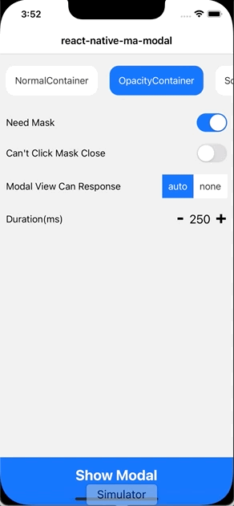
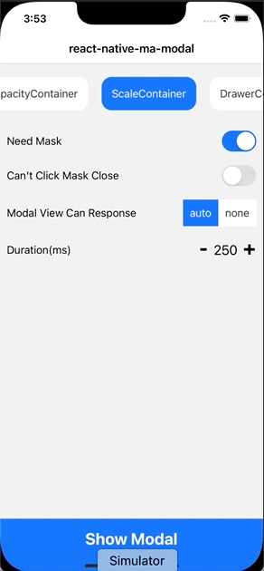
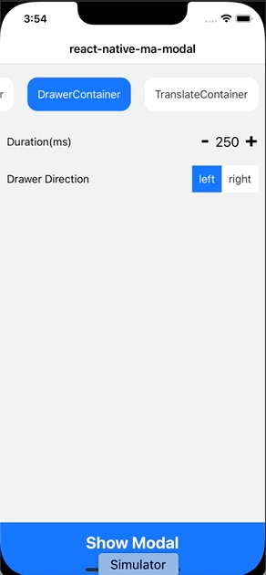
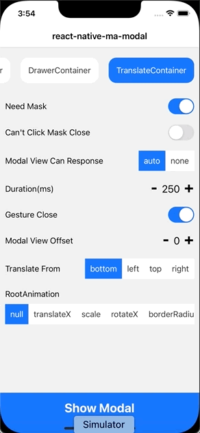
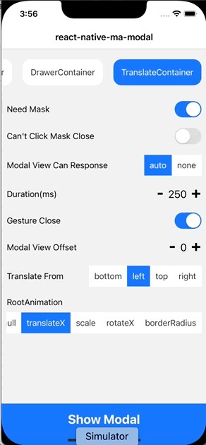

# react-native-ma-modal

This component is a react-native popup component implemented using TypeScript, which supports custom animations as well as customizable popup content.


|  |  |  |
|-|-|-|
|     |      |     |

## install

Before using it, please install react-native-reanimated and react-native-gesture-handler first.

```
npm install react-native-reanimated react-native-gesture-handler
```
And properly configure the project. For details, please refer to:
- [react-native-reanimated](https://github.com/software-mansion/react-native-reanimated)
- [react-native-gesture-handler](https://github.com/software-mansion/react-native-gesture-handler)

install`react-native-ma-modal`
```
npm install react-native-ma-modal
```

## usage
For usage examples, please refer to
[Demo](https://github.com/mahaaoo/react-native-ma-modal/blob/main/example/src/Home.tsx)
